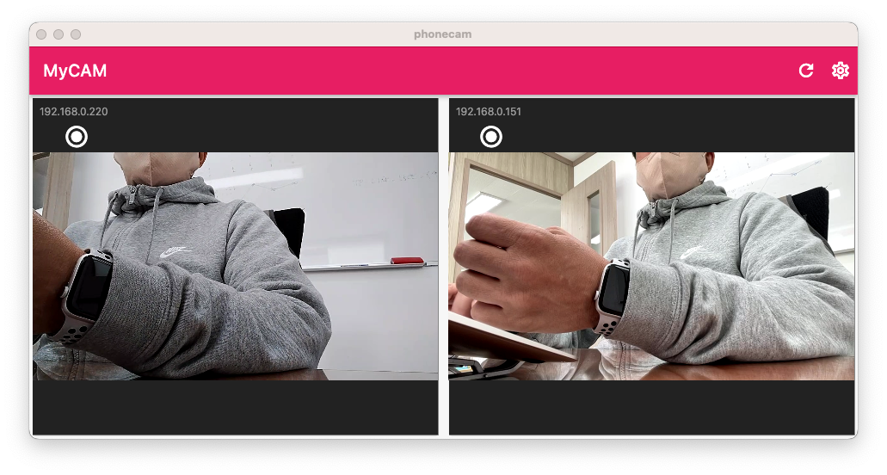

# Flutter WebRTC Camera

스마트폰(iOS /Android)카메라를 Wifi를 통하여 웹캠처럼 사용할 수 있는 아이폰/안드로이드/맥용 앱입니다.
맥앱을 먼저 빌드해서 실행한 후 아이폰, 안드로이드 앱을 빌드해서 동일한 Wifi 네트웍에서 실행하면 자동으로 카메라를 찾아내서 그림과 같이 연결됩니다. 

It is an app for iPhone/Android/Mac that allows you to use a smartphone (iOS/Android) camera like a webcam through WiFi. Build and run the Mac app first, then build the iPhone and Android apps and run on the same WiFi network, the camera is automatically found and connected as shown.

# Discovery

카메라는 Zeroconf 기반의 패키지인 bonsoir를 이용하여 로컬 네트워크에서 앱이 실행되면 자동으로 연결됩니다. 

The camera connects automatically when the app is launched on the local network using bonsoir, a package based on Zeroconf.

# WebRTC & SocketIO

호스트와 스마트폰 화상통신은 WebRTC 기술 기반으로 연결합니다. 찾은 기기의 IP를 이용하여 Socket 통신을 실행하여 WebRTC 연결에 필요한 데이터를 주고 받습니다.

Host and smartphone video communication are connected based on WebRTC technology. Socket communication is performed using the IP of the found device to send and receive data necessary for WebRTC connection.

# Contact
rtlink.park@gmail.com

http://practical.kr/?p=521[http://practical.kr/?p=521]

